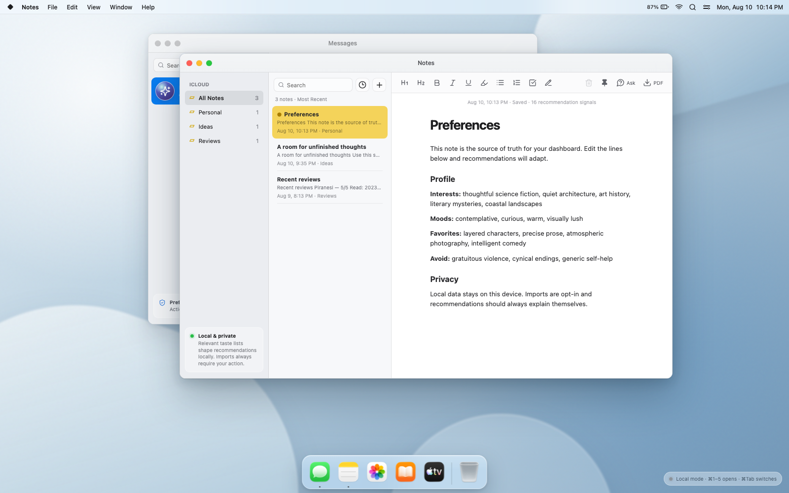
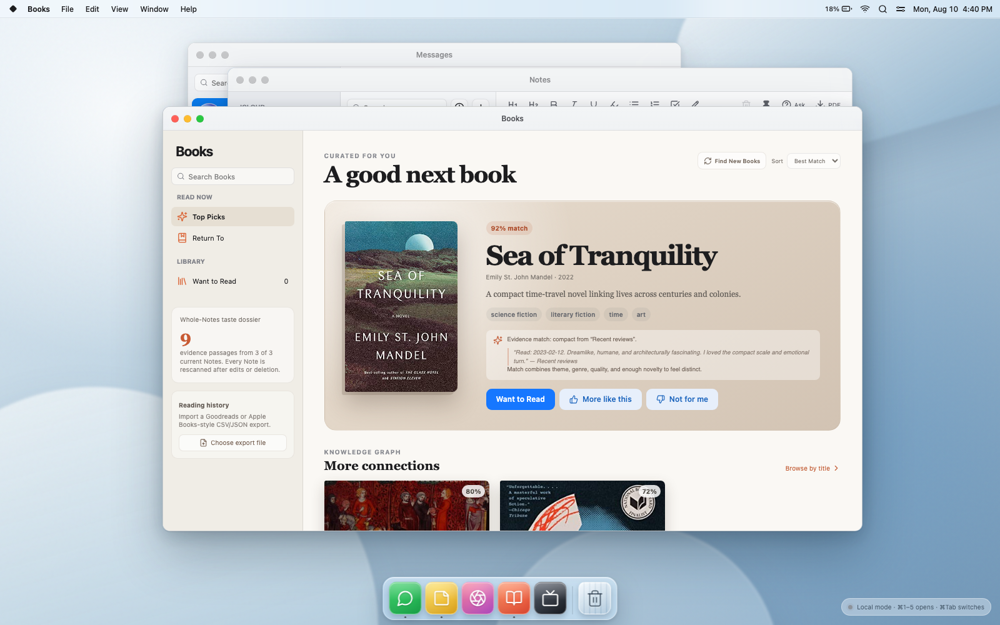
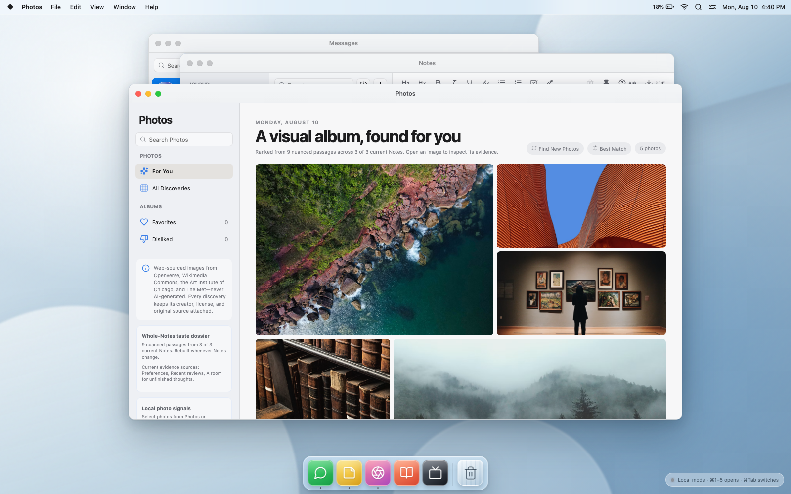

# MacDashboard (MacCeption)

## Short Description: 
A cute little Mac-inspired dashboard for Codex! I had Codex whip most of this up for me, but I did design all of the features and work on a few things where it didn't get the aesthetic quite right. I'll be adding more in the way of recommendations and apps, but it currently features a book/movie recommendation engine, a photo recommendation engine, a notes app that functions as the profile for the recommendations, and a messages assistant. 

# Official Doc

[](https://github.com/wildfellhall/MacDashboard/actions/workflows/ci.yml)
[](LICENSE)

A local-first, AI-powered personal dashboard with a macOS-inspired desktop and
five connected app experiences: Notes, Messages, Books, Photos, and TV.

MacDashboard turns the Notes that exist now—not deleted snapshots or a single
favorite title—into inspectable recommendation evidence. AI proposes varied
Books and TV candidates, public web catalogs verify them, and deterministic
constraints enforce dislikes, history, novelty, and creator diversity.

> [!IMPORTANT]
> MacDashboard is a local single-user application. Its assistant service is not
> designed to be exposed directly to the internet.

## Screenshots

All screenshots use a clean browser profile and the fictional demo content that
ships with the repository.



| Books recommendations | Photo discovery |
| --- | --- |
|  |  |

## Quick start

Requirements: Node.js 22.9 or newer, npm 10 or newer, and a current desktop
browser. Codex or an OpenAI API key is optional; the dashboard remains usable in
its clearly labeled local mode without either.

```bash
git clone https://github.com/wildfellhall/MacDashboard.git
cd MacDashboard
npm ci
cp .env.example .env
npm run dev
```

Open `http://127.0.0.1:4175`. The command starts the Vite interface and local
assistant service together. No personal Notes, histories, or credentials are
included in the repository.

Messages uses the authenticated local Codex CLI through `@openai/codex-sdk` by
default. If `codex login status` reports that you are signed in, the dashboard
reuses that ChatGPT-backed login; no separate API key is required. Run
`codex login` before starting the dashboard if needed.

The Codex conversation is durable across dashboard/server restarts. The server
stores only its current thread ID pointer in
`.macdashboard/codex-thread-id`—not a second transcript—and resumes that thread
on the next message. In Messages, open the conversation info panel and choose
**New Codex Conversation**, then confirm, to clear the local pointer. The next
message starts and persists a fresh thread; resetting does not delete the old
Codex thread from the underlying account.

Dashboard Codex turns use a deliberately constrained local agent: the workspace
is read-only, network access and web search are disabled, and approval prompts
are disabled. It receives the same bounded dashboard context and reviewed action
surface described below. A user-selected image is materialized only for its
turn and then removed.

If Codex is not authenticated, the service falls back at startup to the OpenAI
Responses API when `OPENAI_API_KEY` is set in `.env`. That key remains on the
local server and is never included in the browser bundle. If neither provider is
configured, Messages uses its clearly labeled deterministic local mode. A
failure after a generative provider has been selected never runs deterministic
fallback actions or recommendation searches. The request remains with that
provider, existing recommendations stay unchanged, and the UI reports a
retryable AI error.

Optional assistant settings:

```dotenv
CODEX_MODEL=
OPENAI_MODEL=gpt-5.6-sol
OPENAI_SAFETY_IDENTIFIER=
API_PORT=4176
DASHBOARD_ORIGINS=http://127.0.0.1:4175,http://localhost:4175
TMDB_READ_ACCESS_TOKEN=
TMDB_REGION=US
```

`CODEX_MODEL` optionally overrides the authenticated account default. The
OpenAI safety identifier is optional; if blank, the server creates a private
per-install seed and hashes it before use. TV discovery works without a TV
credential through Apple Search and TVmaze. An optional TMDB API Read Access
Token adds current provider availability for movies and series in
`TMDB_REGION` (default `US`); it stays on the local server.

## Current experience

- macOS-style working Window/File/Help menus with arrow-key navigation, live
  clock, translucent dock, running indicators, and adjacent-icon magnification
- a glass `⌘Tab` application switcher that follows active-window z-order,
  labels minimized apps, and restores the selected window on release; the
  Window menu also lists and activates every running app
- the actual installed macOS Messages, Notes, Photos, Books, TV, and Trash
  artwork when running on a Mac; a local setup step renders those system assets
  into the git-ignored `public/local-icons` directory, while other platforms use
  original redistributable Lucide-based fallbacks
- overlapping windows with active/inactive states, dragging, resizing,
  minimizing, maximizing, closing, full-rectangle viewport containment, unique
  pointer/keyboard focus ordering, container-responsive app layouts, title-bar
  double-click Zoom, and `⌘M`/`⌘W` window shortcuts
- Notes with folders, pinning, search, rich formatting, autosave, a persistent
  pencil/eraser sketch surface, PDF export, sanitized pasted HTML, and a
  structured Preferences note. Relevant ordinary notes—such as Favorite Shows,
  Books to Read, visual inspiration, moods, and dislikes—also contribute
  bounded local recommendation signals and show their current signal count;
  PDF export renders both rich note HTML and its sketch with automatic
  pagination
- Messages with search, timestamps, reactions, emoji, real bounded image
  attachments, a Tapback palette, an emoji picker, provider/error status,
  privacy details, inspectable/resettable learned taste signals, typing
  feedback, quick prompts, and an opt-in local TXT/CSV/JSON chat-topic importer.
  Every query performs bounded local retrieval across Notes and labels the
  specific Notes whose excerpts informed the response
- safe assistant actions that can open an app, navigate a section, search,
  focus a validated recommendation, select an existing note, or stage a
  grounded Books/Photos/TV library change
- preference, note-edit, and new-note suggestions with explicit accept/reject
  review; none of those mutations happens silently. The generic edit path is
  prohibited from targeting the special Preferences note, and direct Messages
  requests for note contents also require one-request sharing consent
- Books discovery, library and want-to-read views, reread timing, persistent
  like/dislike feedback, opt-in Goodreads/Apple-Books-style CSV or JSON
  reading-history imports, and an explicit AI-planned **Find New Books** flow
  whose proposed real titles are verified against Open Library with source
  links
- Photos search, favorites, dislikes, sorting, source attribution, preview,
  robust downloads, and an explicit **Find New Photos** search across
  Openverse, Wikimedia Commons, the Art Institute of Chicago, and The Met,
  retaining creator and license provenance. Dislikes hide an image from For
  You and lower the shared visual tags until undone. Search fans out across
  focused aesthetic interests instead of requiring one oversized phrase to
  match. An opt-in local photo selector derives aggregate filename/folder and
  palette signals on-device
- TV discovery, Up Next, Return-key search, recommendation details, saving, an
  explicit AI-planned **Find Across Platforms** flow whose title candidates are
  verified across Apple and TVmaze, service badges and links, platform
  filtering, optional TMDB/JustWatch movie and series availability, and opt-in
  parsing of Netflix-style CSV and Prime-style JSON history exports

Keyboard shortcuts `⌘1` through `⌘5` open the five main apps. `⌘Tab` cycles
between running apps, including minimized ones.

## Personalization

The Preferences note is the structured profile, but it is no longer the whole
personalization system. A local **taste dossier** scans the headings, prose,
lists, and blockquotes of every Note that exists now. Preference-bearing
clauses become source-linked evidence with a domain, positive/negative/curious
polarity, strength, concepts, and the exact originating passage. Contrasts and
conditions stay separate: “I love intricate mysteries without cynicism” yields
positive mystery evidence and a negative constraint against cynicism.
Unrelated prose is scanned but does not get forced into recommendation scores.

Books and TV now match that evidence against titles, metadata, and full catalog
descriptions; Photos uses titles, creator metadata, provenance reasons, and
tags. For fresh Books and TV discovery, a new isolated Codex planning turn
reasons across the bounded whole-Notes dossier and proposes a deliberately
varied slate of real titles. Each proposal must synthesize more than one taste
dimension, rotate source Notes, respect negative evidence, and keep obvious
neighbors of any one named favorite to at most two. The web catalogs then
verify those titles and supply inspectable metadata and source links; unverified
AI titles are discarded.

Deterministic matching remains a constraint and safety layer, not the primary
fresh recommender. It enforces dislikes, known-title/reread timing, feedback,
and a maximum-marginal-relevance pass that penalizes repeated authors and
near-identical theme clusters. A title such as **Little Women** remains one
meaningful anchor without expanding its author, genres, and themes back into
the global profile. Provider query words are never copied into candidate
genres, moods, themes, or descriptions. The leading evidence passage and Note
title appear beside the recommendation, and AI-planned items also show their
cross-Note synthesis. Books, Photos, and TV libraries plus feedback remain
durable across window close/reopen; undoing a UI choice retracts its learned
signal.

Notes-derived taste is never stored as a separate profile snapshot. The entire
dossier is recomputed from the Notes that exist now on every edit or deletion.
Deleting a Note retracts its passages, concepts, search seeds, score
adjustments, and assistant context. Previously found images remain inspectable
in **All Discoveries**, but no deleted Note continues to shape **For You** or
future searches.

Messages receives a bounded form of the current taste dossier in addition to
the existing query-specific retrieval index. The dossier retains passage-level
polarity, strength, domain, concepts, and source Note titles; coverage selection
includes at least one evidence passage from each evidence-bearing Note before
adding more passages. Each recommendation also includes its description,
evidence summary, and matching Note titles so Codex can reason about the
candidate rather than repeat a numeric score. Direct retrieval can add up to
four excerpts of at most 520 characters each. A request to edit, rewrite, or
deeply review a whole Note still uses the explicit one-request sharing flow.

Notes in the Reviews folder are parsed locally into bounded title, rating,
review-date, and time-spent metadata. Preference-bearing clauses may also enter
the bounded taste dossier; the full review body is not sent. Opted-in viewing
history changes TV discover/rewatch classification and timing. A user-triggered
Apple search can ground the most recent imported title even when it was not in
the bundled catalog. Opted-in reading
history contributes ratings, completion dates, time spent, author affinity, and
the bounded taste dossier. Messages receives the same current
scores and signal provenance that the interface uses, so its explanations and
safe item-selection actions can be grounded in current dashboard state.

Recommendations remain inspectable. Books and TV expose match scores and
plain-language reasoning, including affinity, novelty, quality, and time since a
previous read or watch. Photo recommendations are web-sourced and attributed;
none of the recommended photos are generated with AI. Fresh Openverse,
Commons, Art Institute of Chicago, and The Met results are locally cached and
search happens only after the user clicks the control.
Fresh Open Library books follow the same explicit-request rule, retain a link
to the catalog work, and are cached locally alongside the bundled catalog. The
AI planner supplies exact title-plus-author searches rather than using a single
favorite or thematic phrase as the whole search.
Fresh TV candidates retain their source and official-service links and are
requested only when the user clicks the discovery control, presses Return in
the TV search field, or clicks its inline Search control. TVmaze is used for
verified title/alias lookup—not as a semantic mood engine—and its results add
network or web-channel metadata immediately. If a server-side TMDB token is
configured, regional subscription, free, ad-supported, rental, and purchase
providers become recommendation signals as well. The UI attributes TVmaze,
TMDB, and JustWatch data at the point of use. Apple catalog matches also expose
a JustWatch comparison search, so movie availability is not trapped in the
Apple storefront when full provider metadata is not configured.

The local photo importer never silently scans the Mac. The user selects up to
120 images, analysis samples at most 24 palettes in the browser, and only
aggregate tags, palette labels, format counts, and the image count persist.
Image bytes and filenames are neither stored nor uploaded. Messages may receive
those bounded aggregate labels so its explanations match Photos scoring.

The chat importer follows the same boundary: it scans at most 5,000 messages
from a user-selected export against a fixed, non-identifying topic taxonomy.
Only topic labels, counts, the message count, and import date persist or enter
assistant context; names and message prose are discarded immediately.

## Privacy and permissions

- The assistant server binds only to `127.0.0.1` and rejects non-loopback
  clients and localhost pages on ports other than the configured dashboard
  origins.
- An authenticated Codex CLI session is the preferred Messages provider. Codex
  runs through the local SDK with a read-only sandbox, network/web search
  disabled, and no approval escalation. Only the current thread ID pointer is
  persisted locally; the confirmed reset control clears that pointer.
- OpenAI requests use `store: false`.
- `store: false` disables response-object storage; standard API
  abuse-monitoring retention may still depend on the OpenAI account's data
  controls.
- Requests are size-limited, rate-limited, and validated at the server boundary.
- Model-produced dashboard actions are parsed through a small allowlist.
- Image attachments must match their declared format's file signature and
  bounded dimensions, not just its filename or MIME label.
- Recent conversation, the merged bounded profile derived from Preferences and
  recommendation-relevant Notes, active app, note titles, up to four
  query-matched bounded Note excerpts, bounded taste/review metadata, and
  current recommendation scores may be sent when AI is enabled. The response
  visibly identifies the Notes used.
- Full note bodies and sketches are excluded unless you explicitly click **Ask
  Dashboard about this note** or approve one-request access in Messages.
  Recommendation parsing and query matching happen on-device; only bounded
  extracted taste phrases and short excerpts relevant to the current query
  enter assistant context.
  Message attachments are included only after you select one and press Send.
  An authorized note sketch is rendered locally to a bounded PNG for that
  request only. Preference, note, and library changes remain reviewed
  suggestions.
- Notes HTML is sanitized through an allowlist before it is persisted or
  rendered.
- Notes, Messages, app libraries, opted-in history, and personalization events
  persist in this browser's local storage; local storage is device-local, not
  encrypted storage.

This version does not silently scan Photos, Downloads, Apple Messages, Netflix,
or Prime Video. Local media access and account-history access remain explicit,
opt-in import flows. Books and TV accept user-selected history exports; other
connectors will follow the same permission boundary.

## Verify a change

```bash
npm run check
npm run test:http
npm audit
```

The local service also exposes `GET /api/health` and `GET /api/config` through
the Vite proxy. Implementation notes for the service are in
[`server/README.md`](server/README.md).

## Public-release safeguards

- `npm run audit:public` scans every tracked file for common credential formats,
  populated secret settings, personal home-directory paths, local runtime data,
  and disallowed extracted icon assets.
- `.env`, `.macdashboard`, dependencies, builds, editor settings, logs, and
  coverage output are ignored.
- CI runs the public-release audit, lint, unit tests, build, and local HTTP tests
  on supported Node.js versions.
- Dependabot checks npm dependencies weekly; the committed lockfile currently
  reports zero known vulnerabilities through `npm audit`.
- The repository includes only fictional sample Notes and Messages. User-created
  content remains in that browser profile's local storage.

See [CONTRIBUTING.md](CONTRIBUTING.md) for development and asset rules and
[SECURITY.md](SECURITY.md) for private vulnerability reporting and the local
deployment boundary.

## License and attribution

MacDashboard source code is available under the [MIT License](LICENSE).
Interface glyphs come from [Lucide](https://lucide.dev/) under the ISC license.
Apple icon artwork is loaded only from the user's own macOS installation and is
never committed or redistributed by this repository.
Discovery results retain source, creator, and license attribution in the UI;
third-party catalog metadata and artwork remain subject to their respective
providers' terms.

This is an independent project inspired by desktop interaction patterns. It is
not affiliated with or endorsed by Apple Inc. Apple, macOS, Mac, and the names
of Apple applications are trademarks of Apple Inc. Other product and company
names belong to their respective owners.
